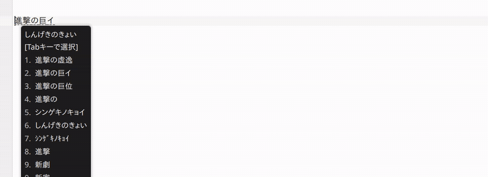

# Hazkey Community

<p align="center">
  
  
</p>

[](https://github.com/7ka-Hiira/hazkey)
[](https://fcitx-im.org/)
[](https://github.com/ibus/ibus)

<br>

Hazkey Communityは、Linux向けデスクトップ環境のインプットメソッドフレームワーク[Fcitx 5](https://fcitx-im.org/) および [IBus](https://github.com/ibus/ibus)で動作する日本語インプットメソッドです。  
[AzooKeyKanaKanjiConverter](https://github.com/azooKey/AzooKeyKanaKanjiConverter)を変換エンジンに採用し、  
オプションでニューラル変換 (Zenzai、llama.cppバックエンド、Vulkan GPU / CPU対応) を利用でき、標準のzenz系列に加えてQwen3ベースの**jinen-v2**モデルにも対応しています。  

Fcitx 5フロントエンド (fcitx5-hazkey-community) に加えて、実験的なIBusフロントエンド (ibus-hazkey-community) を同梱します。  

> IBus版をソースコードからビルドする場合は、CMakeで`-DENABLE_IBUS=ON`オプションが必要です。(デフォルトはOFF)  
> バイナリパッケージは両フロントエンド分を頒布します。  

本リポジトリは [7ka-Hiira/hazkey](https://github.com/7ka-Hiira/hazkey) をベースにしたコミュニティ版で、現在のバージョンは **v0.2.37** です。  

> **上流版 (hazkey公式) の情報**  
> - ホームページ: [https://hazkey.hiira.dev](https://hazkey.hiira.dev)  
> - ドキュメント: [https://hazkey.hiira.dev/docs](https://hazkey.hiira.dev/docs)  

<br>

## 対応環境

| ディストリビューション | 動作確認・サポート | CIビルド・パッケージ頒布 |
|:---|:---:|:---:|
| **Fedora 44** | **対象** | **対象** |
| **openSUSE Leap 16** | **対象** | **対象** |
| **Debian 13 (Trixie) x64** | **対象** | **対象** |
| **Debian 13 (Trixie) AArch64** | 対象外 | **対象** |
| **Ubuntu 26.04** | 対象外 | **対象** |
| **openSUSE Tumbleweed** | 対象外 | **対象** |

- パッケージの頒布は、その環境での動作保証を意味しません。  
- その他のディストリビューションでの動作は保証しません。  
- 上流版の対応環境・インストール方法については、[上流ドキュメント](https://hazkey.hiira.dev/docs)を参照してください。  

<br>

## コミュニティ版の主な機能 (v0.2.2-community以降)

上流に対するコミュニティ版独自の追加機能・改善の概要です。  
各機能の詳細は、[docs/features.md](./docs/features.md)を参照してください。  

### 入力・変換

| 機能 | 操作 (既定値) | 初期状態 | 概要 |
|:---|:---|:---:|:---|
| **文節境界調整** | `[Shift] + [Left]` / `[Shift] + [Right]` | - | 変換中に文節の境界を調整 |
| **ライブ変換トグル** | `[Ctrl] + [Shift] + [L]` | - | ライブ変換のON / OFFを即座に切替 |
| **予測候補の先頭表記固定** | `[F5]` | - | サジェスト候補で押下すると、その表記を固定して続きを入力 |
| **誤字の訂正候補** | - | `OFF` | 打ち間違いを訂正した読みの変換候補を提示 |
| **候補ウィンドウのマウス選択** | マウスクリック | - | 変換候補をマウスクリックで選択 |

### 辞書

| 機能 | 初期状態 | 概要 |
|:---|:---:|:---|
| **ユーザ辞書 (品詞・動詞活用対応)** | - | TSV形式で単語を登録できる。<br>品詞 (固有名詞・人名・地名・動詞) 指定に対応し、設定UIから編集・インポート・エクスポートが可能 |
| **動詞活用エンジン** | - | ユーザ辞書の動詞から、五段活用・一段活用・サ行変格の全活用形を自動生成 |
| **Emoji 17直接変換** | `ON` | Emoji 17.0辞書による絵文字の直接変換候補 |
| **日本全国の地名辞書** | `OFF` | 難読地名47,934件を組み込み辞書として収録 |
| **工学用語辞書** | `OFF` | 専門用語・名称859件を組み込み辞書として収録 |

### 学習・履歴

| 機能 | 操作 (変更可) | 概要 |
|:---|:---|:---|
| **学習データの削除・履歴管理** | `[Ctrl] + [D]` | 候補の学習データを削除<br>設定UIから入力履歴の管理も可能 |
| **プロファイルごとの履歴分離** | - | プロファイルごとに学習データを分離して保存可能 |

### ニューラル変換 (Zenzai)

| 機能 | 概要 |
|:---|:---|
| **ニューラル変換設定の拡充** | プロファイル指定、カスタムGGUFモデル、モデル管理GUI、右文脈、アラインメント区切り等 |
| **複数モデルに対応 (zenz / jinen-v2)** | 標準のzenz系列に加え、Qwen3ベースのjinen-v2 (small / xsmall) に対応 |
| **事前ウォームアップ** | サーバ起動時・設定適用後にモデルを事前ロードし、初回入力の待ち時間を解消 |

### 安定性

| 機能 | 概要 |
|:---|:---|
| **サーバ管理の安定化** | クライアント更新時のサーバ自動再起動、不正設定ファイルの安全なパース等 |
| **マルチGPU環境のSIGILL回避** | 起動前のバックエンド安全確認とCPU専用への自動フォールバックで起動時クラッシュを解消<br>([トラブルシューティング](./docs/troubleshooting.md)参照) |

<br>

## クイックスタート (GitHub Releasesからインストール)

サポート対象環境では、ソースビルド不要でGitHub Releasesのパッケージをインストールできます。  

1. [Releases ページ](https://github.com/presire/hazkey-community/releases)から最新版 (**v0.2.20-community**以降) を開きます。  
2. お使いのディストリビューション向けのアーカイブ (`.deb` または `.rpm`) をダウンロードします。  
   パッケージは、Debian 13 / Ubuntu 26.04向けに `.deb`、Fedora 44 / openSUSE Leap 16 / Tumbleweed 向けに `.rpm` が頒布されます。  
   
   フロントエンドごとにパッケージが分かれています。(fcitx5-hazkey-community: Fcitx 5用、ibus-hazkey-community: IBus用)  
   
   使用するフレームワークのパッケージを選んでください。  
   両方入れておくこともできます。(Fcitx 5とIBusを同時に有効化して使用できます。詳細は[docs/ibus-frontend.md](./docs/ibus-frontend.md)参照)  
   
   - Debian / Ubuntu (`.deb`):  
     両パッケージは共有ファイル (hazkey-community-server / hazkey-community-settings / 辞書等) を相互に上書きできるよう `Replaces` を宣言しており、  
     どちらの順に入れても共存できます。  
   - RPM (`.rpm`):  
     追加の宣言なしに共存できます。  
   
   両フロントエンドのパッケージは同じバージョンで揃えて使用してください。(異なるバージョンの混在は非サポートです)  
   
   > **共有ファイルの扱い (Debian / Ubuntu)**:  
   > 両パッケージは `/usr/bin/hazkey-community-server` 等の共有ファイルを同じパスに含みます。  
   > dpkgは共有ファイルを「最後にインストールした側」の所有として扱うため、  
   > 後から入れた側を `apt remove` / `dpkg -r` コマンドを実行すると、残した側の共有ファイルも一緒に削除されます。  
   > 残す側のパッケージを再インストール (例: `sudo apt install --reinstall ./fcitx5-hazkey-community_*_amd64.deb`) すると復旧します。  
   > RPM (`.rpm`) では、片方を削除してももう片方が残っていれば共有ファイルは削除されません。  
3. ダウンロードしたパッケージをインストールします。(パスはダウンロード先に合わせてください)  
   
   ```sh
   # Fedora (使用するフレームワークのパッケージを指定)
   sudo dnf install ./fcitx5-hazkey-community-*.rpm
   sudo dnf install ./ibus-hazkey-community-*.rpm
   
   # openSUSE (使用するフレームワークのパッケージを指定)
   sudo zypper install ./fcitx5-hazkey-community-*.rpm
   sudo zypper install ./ibus-hazkey-community-*.rpm
   
   # Debian / Ubuntu系 (使用するフレームワークのパッケージを指定)
   sudo apt install ./fcitx5-hazkey-community_*_amd64.deb
   sudo apt install ./ibus-hazkey-community_*_amd64.deb
   ```
   
4. 使用しているフレームワークを再起動します。  
   (Fcitx 5はログアウト / ログイン、または下記の「初回の有効化」の手順。IBusは、`ibus restart`コマンド等)  

> インストール後、設定UI (hazkey-community-settings) と サーバ (hazkey-community-server) は同じバージョンで揃います。  
> クライアントとサーバのバージョンが不一致になった場合は、hazkey-community-serverが自動的に再起動されます。  

### ダウンロードの検証 (SHA-256・GPG署名)

Releasesページにはパッケージと合わせて、`SHA256SUMS`が配置されています。  
ダウンロード後は、次の手順で破損・改竄の有無を確認できます。  

```sh
# .deb / .rpmと同じディレクトリにSHA256SUMSを配置して実行
sha256sum -c SHA256SUMS
```

RPMパッケージはGPG署名付きで頒布されています。(DEBは署名検証を行わないため不要です)  

初回に1回だけ公開鍵 (RPM-GPG-KEY-hazkeyファイル: Releasesページから取得) を登録すると、  
以降のdnf / zypperコマンドでのインストール時に署名警告が表示されなくなります。  

```sh
# 公開鍵の登録 (初回のみ)
sudo rpm --import RPM-GPG-KEY-hazkey

# 署名の確認 (任意)
rpm -K ./fcitx5-hazkey-community-*.rpm ./ibus-hazkey-community-*.rpm
```

ビルドの来歴証明 (Artifact Attestation) も付与されています。  
ghコマンドがある環境では、次のコマンドで「このCIでビルドされた」ことを検証 (任意) できます。  

```sh
gh attestation verify ./fcitx5-hazkey-community-*.rpm ./ibus-hazkey-community-*.rpm --owner presire
```

<br>

## 以前のバージョンからのアップグレード

v0.2.30-community以降で、インストール先・実行ファイル名・ユーザデータの保存先・サーバソケット名が上流版Hazkeyから分離され、  
名称が**Hazkey Community**に統一されました。  
v0.2.30-communityより前のバージョンからアップグレードする場合は、パッケージの入れ替えとデータの移行が必要です。  

- パッケージ名が変更されたため、旧パッケージからの上書き更新はできません。  
  旧パッケージを削除してから、新しいパッケージをインストールしてください。  
- 既存の設定・ユーザ辞書・ニューラル変換モデル・学習データは自動では引き継がれません。  
  引き継ぐ場合は、下記「既存データの移行 (手動)」の手順で1回だけ手動移行してください。  
- 入力メソッドの登録名も変更されるため、インストール後にFcitx 5 / IBusを再起動して、  
  改めて、**Hazkey Community**を追加し直してください。(下記「初回の有効化」参照)  

### 既存データの移行 (手動)

名称変更前のHazkey Community、または上流版Hazkeyで使用していた設定・ユーザ辞書・Zenzaiモデル・学習データは、自動では引き継がれません。  
引き継ぐ場合は、同梱の移行スクリプトを手動で1回実行します。(旧ディレクトリはコピーするだけで、変更しません)  

```sh
# 実行内容の確認のみ (何も変更しない)
/usr/share/hazkey-community/hazkey-community-migrate.sh --dry-run

# 移行を実行する
/usr/share/hazkey-community/hazkey-community-migrate.sh
```

移行対象・スクリプトの動作・オプション (`--force`等) の詳細は、[docs/migration.md](./docs/migration.md)を参照してください。  
移行後は、Fcitx 5 / IBusを再起動し、入力メソッド**Hazkey Community**を追加してください。  

<br>

## 初回の有効化

### Fcitx 5に登録

1. Fcitx 5を再起動します。  
   
   ```sh
   systemctl --user restart fcitx5.service
   # または fcitx5 を終了してから再度起動
   ```
   
2. Fcitx 5の設定ツール (タスクトレイアイコンから[設定]、または `fcitx5-configtool`) を開き、入力メソッドの追加から**Hazkey Community**を登録します。  
3. 入力メソッドの切替 (デフォルトでは、`[Super] + [Space]` 等、Fcitx 5側の設定に依存) でHazkey Communityに切り替え、ローマ字入力してかなが変換できることを確認します。  
4. 設定を変更する場合は、アプリケーションメニューまたはターミナルから **hazkey-community-settings** を起動します。  
   
   ```sh
   hazkey-community-settings
   ```

### IBusに登録 (実験的)

1. ibus-daemonを再起動します。  
   
   ```sh
   ibus restart
   # またはログアウト / ログイン
   ```
   
2. ibus list-engineに**Hazkey Community**が表示されることを確認します。  
   
   ```sh
   ibus list-engine | grep hazkey-community
   ```
   
3. デスクトップ環境の入力ソース設定 (GNOME の[設定]→[キーボード]→[入力ソース]等) または `ibus-setup` から**Hazkey Community**を追加します。  
4. 入力メソッドの切替 (デフォルトでは `Super+Space` 等、環境の設定に依存) でHazkey Communityに切り替え、ローマ字入力してかなが変換できることを確認します。  
5. 設定を変更する場合は、アプリケーションメニューまたはターミナルから **hazkey-community-settings** を起動します。  
   
   ```sh
   hazkey-community-settings
   ```

<br>

## 上流版Hazkeyとの併存

Hazkey Communityは、インストール先・実行ファイル名・ユーザデータのディレクトリ・ソケット名を上流版Hazkeyと分けているため、  
上流版Hazkey (fcitx5-hazkey) と同時にインストールできます。  
入力メソッド名も別 (Fcitx 5 / IBus: **Hazkey Community**) で、互いのサーバや設定には干渉しません。  

| 用途 | 上流版Hazkey | Hazkey Community |
|:---|:---|:---|
| **サーバ / 設定UI** | `/usr/bin/hazkey-server`<br>`/usr/bin/hazkey-settings` | `/usr/bin/hazkey-community-server`<br>`/usr/bin/hazkey-community-settings` |
| **プログラム / データ** | `/usr/lib*/hazkey/`<br>`/usr/share/hazkey/` | `/usr/lib*/hazkey-community/`<br>`/usr/share/hazkey-community/` |
| **Fcitx 5アドオン** | `fcitx5-hazkey.so`<br>`addon/hazkey.conf`・`inputmethod/hazkey.conf` | `fcitx5-hazkey-community.so`<br>`addon/hazkey-community.conf`・`inputmethod/hazkey-community.conf` |
| **IBusエンジン** | `ibus-hazkey.xml`<br>`libexec/ibus-hazkey/ibus-engine-hazkey` | `ibus-hazkey-community.xml`<br>`libexec/ibus-hazkey-community/ibus-engine-hazkey-community` |
| **ユーザデータ** | `~/.config/hazkey/`<br>`~/.local/share/hazkey/`<br>`~/.local/state/hazkey/` | `~/.config/hazkey-community/`<br>`~/.local/share/hazkey-community/`<br>`~/.local/state/hazkey-community/` |
| **サーバソケット** | `$XDG_RUNTIME_DIR/hazkey-server.<uid>.sock` | `$XDG_RUNTIME_DIR/hazkey-community-server.<uid>.sock` |

> 実行ファイル名"hazkey-community-server"は15文字を超えるため、`pgrep -x` / `pkill -x` (プロセス名の完全一致) では一致しません。  
> サーバを終了する場合は、次のようにコマンドライン照合 (`-f`) を使用してください。  
>
> ```sh
> pkill -u $USER -f '^([^ ]*/)?hazkey-community-server( |$)'
> ```

上流版Hazkeyで使用していた設定・ユーザ辞書・ニューラル変換モデル・学習データをHazkey Communityへ引き継ぐ場合は、  
上記「以前のバージョンからのアップグレード」内の「既存データの移行 (手動)」を参照してください。  

<br>

## IBusフロントエンド (実験的)

Fcitx 5と同じhazkey-community-serverを利用する、実験的なIBusフロントエンド (ibus-hazkey-community) です。  
GitHub Releasesのibus-hazkey-communityパッケージ (DEB / RPM) で導入できます。(上記「クイックスタート」参照)  
Fcitx 5とIBusは同時に有効化して使用できます。  

ソースコードからビルドする場合は、CMakeで `-DENABLE_IBUS=ON` を指定します。(既定は**OFF**。詳細は[docs/build.md](./docs/build.md)を参照)  

アーキテクチャ・同時接続の扱い・Fcitx 5版との差異・既知の制約は、[docs/ibus-frontend.md](./docs/ibus-frontend.md)を参照してください。  

<br>

## ニューラル変換 (Zenzai / Jinen v2) のセットアップ

Zenzai / jinen-v2のモデル選択・有効化手順・Vulkanドライバの導入・GPU/iGPU要件・モデルの保存場所は、  
[docs/neural-conversion.md](./docs/neural-conversion.md)を参照してください。  

<br>

## 設定・環境のリファレンス

設定ファイル・ユーザ辞書・モデル・学習データ・ソケットの場所 (XDGベースディレクトリ準拠) と、  
サーバ起動時に効く環境変数 (`~/.config/hazkey-community/env`) は、[docs/configuration.md](./docs/configuration.md)を参照してください。  

<br>

## ソースコードからのビルド

ソースコードからビルドするための依存関係・Swiftのインストール・ビルド手順・ビルドオプションは、[docs/build.md](./docs/build.md)を参照してください。  

<br>

## トラブルシューティング

既知の問題と対処 (マルチGPU環境でのSIGILLクラッシュ、使用中のフレームワークが新しいバージョンを認識しない、サーバに接続できない等) は、  
[docs/troubleshooting.md](./docs/troubleshooting.md)を参照してください。  

<br>

## 上流・関連プロジェクト

| プロジェクト | 用途 |
|:---|:---|
| [7ka-Hiira/hazkey](https://github.com/7ka-Hiira/hazkey) | 本プロジェクトの上流<br>ドキュメント: [https://hazkey.hiira.dev/docs](https://hazkey.hiira.dev/docs) |
| [azooKey/AzooKeyKanaKanjiConverter](https://github.com/azooKey/AzooKeyKanaKanjiConverter) | 変換エンジン (本プロジェクトは、フォークのhazkeyブランチを使用) |
| [ensan-hcl/azooKey](https://github.com/ensan-hcl/azooKey) | 動詞活用エンジンの移植元 |
| [Miwa-Keita/zenz-v3.2-small-gguf](https://huggingface.co/Miwa-Keita/zenz-v3.2-small-gguf) / [zenz-v3.2-xsmall-gguf](https://huggingface.co/Miwa-Keita/zenz-v3.2-xsmall-gguf) / [zenz-v3.1-small-gguf](https://huggingface.co/Miwa-Keita/zenz-v3.1-small-gguf) | ニューラル変換モデル (GGUF、zenz系) |
| [togatogah/jinen-v2-small.gguf](https://huggingface.co/togatogah/jinen-v2-small.gguf) / [jinen-v2-xsmall.gguf](https://huggingface.co/togatogah/jinen-v2-xsmall.gguf) | ニューラル変換モデル (GGUF、Qwen3ベース、CC-BY-SA-4.0) |
| [ggml-org/llama.cpp](https://github.com/ggml-org/llama.cpp) | Zenzaiの推論バックエンド |
| [fcitx/fcitx5](https://github.com/fcitx/fcitx5) | インプットメソッドフレームワーク (Fcitx 5フロントエンド) |
| [ibus/ibus](https://github.com/ibus/ibus) | インプットメソッドフレームワーク (IBusフロントエンド) |

## ライセンス

[MIT License](./LICENSE)  

本プロジェクトは、[7ka-Hiira/hazkey](https://github.com/7ka-Hiira/hazkey) (MIT License)をベースにしています。  
Zenzaiモデルのライセンスは上記のモデル一覧を参照してください。  

パッケージには、静的にリンクされるSwiftパッケージや同梱のllama.cppランタイム、各種辞書データ等、  
サードパーティ製コンポーネントのライセンス表示を[ThirdPartyLicenses/](ThirdPartyLicenses)に同梱しています。  

インストール後は、`/usr/share/hazkey-community/ThirdPartyLicenses/`に配置されます。  
(動的にリンクされるQt 6 / Fcitx 5 / IBus / libprotobuf-lite / Vulkan等はパッケージ依存として供給されるため、同梱しません)  
